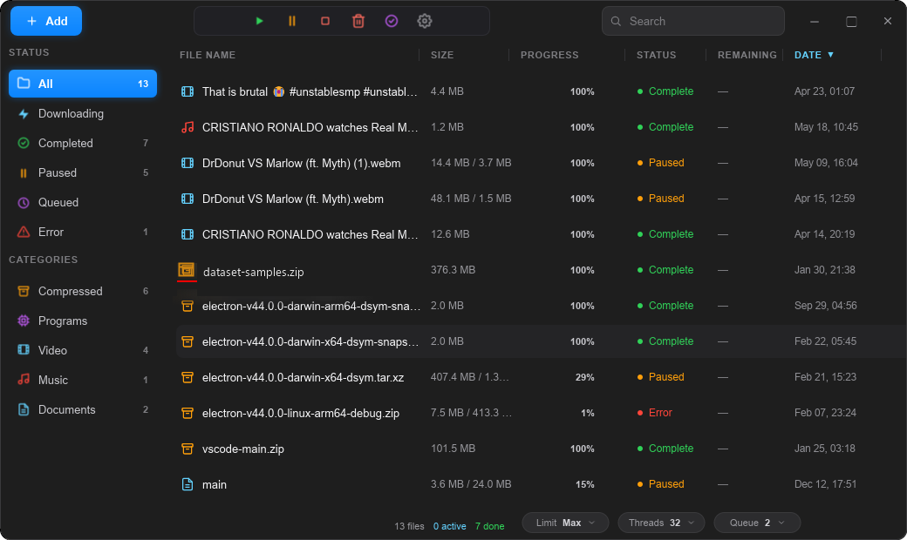
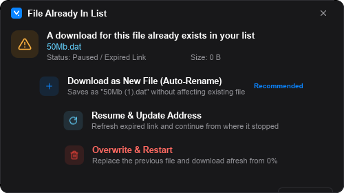

<div align="center">


# VDM — Download Manager

**IDM-grade multi-threaded downloads for Windows. Native Rust + Slint — no webview, no Electron, no bloat.**

[](../../releases/latest)
[](../../releases/latest)
[](https://www.rust-lang.org)
[](https://slint.dev)
[](LICENSE)



</div>

## ✨ Features

-  **Multi-threaded engine** — up to 32 parallel connections per file with HTTP Range work-stealing and sparse pre-allocation
-  **Resumable everything** — pause, resume, and restart from exact byte positions; chunk state persisted in SQLite so downloads survive crashes and reboots
-  **Browser integration** — a companion extension (Chrome / Edge / Brave) intercepts downloads and streams links straight into VDM
-  **IDM-style dialogs** — file info, live per-connection progress, and completion prompts that feel instantly familiar
-  **Speed limiter** — token-bucket throttling from 2 MB/s up to unlimited
-  **Smart categories** — video, music, programs, documents, and archives auto-sorted with per-category save folders
-  **Queue management** — configurable parallel download slots with priority ordering
-  **yt-dlp support** — paste a video URL and VDM delegates to [yt-dlp](https://github.com/yt-dlp/yt-dlp) when it's on PATH
-  **Tray-resident** — lives in the system tray with a custom morphing menu; single-instance via loopback API
-  **Native dark glass UI** — pure GPU-rendered Slint, crisp at any DPI, ~30 MB installed

<div align="center">

| Download Info | File Conflict |
|:---:|:---:|
|  |  |

</div>

## 📦 Install

**Option 1 — Installer (recommended)**

Grab `VDM-Setup-x.y.z.exe` from the [latest release](../../releases/latest) and run it. Includes optional desktop icon, Start Menu shortcuts, and a clean uninstaller.

**Option 2 — From source**

```powershell
git clone https://github.com/bro4cvf-hash/VDM.git
cd VDM
cargo run --release
```

> Requires the [Rust toolchain](https://rustup.rs). First build takes a few minutes.

### Browser extension

1. In VDM, open **Settings → Browser Integration** — VDM extracts the extension and opens the folder for you
2. Open `chrome://extensions` (or `edge://extensions`), enable **Developer mode**
3. Click **Load unpacked** and select the `extension` folder
4. Downloads from the browser now land in VDM 🎉

## 🛠️ Building the installer

```powershell
.\scripts\build-installer.ps1
# → dist\VDM-Setup-<version>.exe
```

Requires [Inno Setup 6](https://jrsoftware.org/isinfo.php): `winget install JRSoftware.InnoSetup`

## 🏗️ Architecture

```
VDM/
├── ui/                     # Slint declarative UI (app window, dialogs, tray menu, theme)
├── src/
│   ├── main.rs             # Window host, tray, poller, UI⇄engine bridge
│   └── engine/
│       ├── downloader.rs   # Task lifecycle, snapshot merging, speed stats
│       ├── worker.rs       # Per-chunk HTTP Range workers, work-stealing
│       ├── probe.rs        # URL probing (yt-dlp / HTTP headers)
│       ├── rate_limiter.rs # Token-bucket speed limiter
│       ├── server.rs       # Loopback API on 127.0.0.1:9191 (single-instance + extension)
│       └── browser.rs      # Extension extraction & browser detection
└── storage/database.rs     # SQLite: tasks, chunks, settings kv
```

**Stack:** `tokio` · `reqwest` (rustls) · `rusqlite` · `slint` · `tray-icon` · `resvg` · Inno Setup

## 📄 License

[MIT](LICENSE) — © 2026 VDM Contributors
